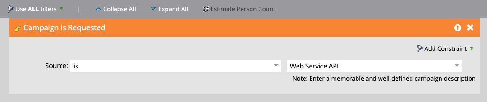

# Trigger einer Smart Campaign in Marketo Engage mit der REST-API und Token

In diesem Tutorial erfahren Sie, wie Sie mit der REST-API den Trigger einer Smart Campaign in Marketo Engage vornehmen und die E-Mail mit „Meine Token“ personalisieren. Dieser Anwendungsfall eignet sich ideal für kundenausgelöste Benachrichtigungen wie Webinar-Erinnerungen, Onboarding-Schritte oder Follow-up nach dem Kauf.

## Anwendungsfall {#use-case}

Eine Person registriert sich über eine externe Plattform (z. B. benutzerdefinierte App, Pendo, Eventbrite) für ein Webinar. Sie möchten automatisch:

* Trigger einer Erinnerungsnachricht von Marketo Engage
* Personalisieren Sie sie mit:
   * Der Vorname der Person
   * Webinar-Titel
   * Eindeutiger Join-Link

Dies kann über die REST-API und „Meine Token“ erfolgen.

## Schritt 1: Erstellen der Smart-Kampagne {#step-one}

1. Gehen Sie **Marketing** Aktivitäten) und erstellen Sie im Ordner [Programme](https://experienceleague.adobe.com/de/docs/marketo/using/product-docs/core-marketo-concepts/programs/creating-programs/understanding-programs){target="_blank"} eine neue [Smart-Kampagne](https://experienceleague.adobe.com/de/docs/marketo/using/product-docs/core-marketo-concepts/smart-campaigns/understanding-smart-campaigns){target="_blank"} namens `Send Webinar Reminder`.

1. Fügen Sie auf **Registerkarte** Smart-Liste[&#x200B; einen Trigger hinzu](https://experienceleague.adobe.com/de/docs/marketo/using/product-docs/core-marketo-concepts/smart-campaigns/creating-a-smart-campaign/define-smart-list-for-smart-campaign-trigger){target="_blank"} damit die Kampagne über die API aufgerufen werden kann:

   * Wählen **Kampagne ist angefordert** als Trigger aus
   * **Source** auf `Web Service API` setzen



## Schritt 2: E-Mail-Inhalt definieren {#step-two}

Erstellen oder bearbeiten Sie ein [E-Mail-Asset](https://experienceleague.adobe.com/de/docs/marketo-developer/marketo/rest/assets/emails){target="_blank"} das sowohl auf Person als auch auf [Meine Token](https://experienceleague.adobe.com/de/docs/marketo/using/product-docs/core-marketo-concepts/programs/tokens/managing-my-tokens){target="_blank"} verweist.

>[!NOTE]
>
>Achten Sie darauf, die Token direkt in den E-Mail-Inhalt einzufügen, wie unten dargestellt.

```html
Hi {{lead.First Name:default=Customer}}

You're registered for **{{my.WebinarTitle}}**.

Join here: {{my.JoinLink}}
```

Wenn Sie ein Token verwenden, um eine Bild-URL dynamisch einzufügen (z. B. `{{my.WebinarImage}}`), müssen Sie das Token in ein HTML-Bild-Tag einschließen:

```html

```

>[!IMPORTANT]
>
>Marketo Engage **wird das** nur rendern, wenn das Token in einem gültigen Bild-Tag platziert ist.


## Schritt 3: Hinzufügen von Token zum Programm {#step-three}

Um Werte dynamisch über die API zu übergeben, müssen die Token bereits in Marketo Engage vorhanden sein. Sie müssen sie auf der Registerkarte **Meine Token** Ihres Programms erstellen.

1. Navigieren Sie zur **Meine Token** Registerkarte Ihres übergeordneten Programms.

2. Ziehen Sie für **dynamischen Wert ein** Text-Token) aus dem rechten Bedienfeld.

* `{{my.WebinarTitle}}` - Text-Token
* `{{my.JoinLink}}` - Text-Token
* `{{my.WebinarImage}}` - Text-Token (wird als `src` in einem ``-Tag verwendet)


## Schritt 4: Festlegen von Kampagnenqualifizierungsregeln und Aktivieren der Kampagne {#step-four}

1. Konfigurieren Sie die [Qualifizierungsregeln](https://experienceleague.adobe.com/de/docs/marketo/using/product-docs/core-marketo-concepts/smart-campaigns/using-smart-campaigns/edit-qualification-rules-in-a-smart-campaign){target="_blank"} um zu steuern, wie oft eine Person die Smart-Kampagne durchlaufen kann.

1. Klicken Sie nach der Konfiguration auf **Aktivieren**, um die Smart-Kampagne für den Empfang von API-ausgelösten Anfragen zu aktivieren.


## Schritt 5: Trigger der Kampagne über die REST-API {#step-five}

### Kampagnen-ID suchen {#find-the-campaign-id}

Um eine Smart Campaign über eine API Trigger, benötigen Sie die **Kampagnen-ID**:

1. Suchen Sie die Smart Campaign, die Sie Trigger machen möchten, und wählen Sie sie aus.

1. Sehen Sie sich die URL in Ihrem Browser an. Er sieht in etwa so aus: `https://app-XXX.marketo.com/#/classic/SC`**1234**`A1ZN38`.

1. Die vier Stellen nach `SC` ist Ihre Kampagnen-ID, im obigen Beispiel lautet die Smart-Kampagnen-ID „1234“

Verwenden Sie den folgenden Endpunkt:

```
POST /rest/v1/campaigns/{campaignId}/trigger.json
```

Beispiel:

```
POST /rest/v1/campaigns/1234/trigger.json
```

### Beispiel-Anfrageinhalt {#example-request-body}

```json
{
  "input": {
    "leads": [
      {
        "id": 1002200
      }
    ],
    "tokens": [
      {
        "name": "{{my.WebinarTitle}}",
        "value": "Scaling Customer Engagement in 2025"
      },
      {
        "name": "{{my.JoinLink}}",
        "value": "https://webinars.company.com/join/abc123"
      },
      {
        "name": "{{my.WebinarImage}}",
        "value": "https://experienceleague.adobe.com/de/docs/marketo-learn/tutorials/events/media_1c6f338a518ada11550084c8ab3a6bbf554ff6eac.jpeg"
      }
    ]
  }
}
```

>[!IMPORTANT]
>
>Ersetzen Sie `1002200` im obigen Textbeispiel durch die richtige Personen-ID aus Ihrer Marketo Engage-Instanz.

## Autorisierung {#authorization}

Alle Marketo REST-API-Anfragen erfordern ein OAuth 2.0-Zugriffstoken.

Verwenden Sie den folgenden Endpunkt, um Ihr Zugriffs-Token abzurufen:

```
GET /identity/oauth/token?grant_type=client_credentials&client_id=XXX&client_secret=YYY
```

Nachdem Sie Ihr Zugriffs-Token erhalten haben, fügen Sie es als _Abfrageparameter_ in alle API-Anfragen ein:

```
Authorization: Bearer YOUR_ACCESS_TOKEN
```

## Bewährte Methoden {#best-practices}

* Hinzufügen von Fallback-/Standardwerten zu Ihren Token für Tests und Qualitätssicherung
* `{{lead.token}}` für Personenfelder und `{{my.token}}` für dynamische Werte im Kampagnenbereich verwenden
* Marketo Engage unterstützt bis zu 100 Personen pro Anfrage
* Personen müssen die Kriterien der Smart-Liste erfüllen, andernfalls werden sie im Hintergrund übersprungen.

## Zusammenfassung {#summary}

Mit diesem Ansatz können Sie die Kommunikation mithilfe von Smart-Kampagnen personalisieren, die von externen Plattformen über die API ausgelöst werden. Dies ist für Szenarien wie Registrierungsbestätigungen für Webinare, Onboarding-E-Mails und Transaktionsbenachrichtigungen nützlich, während gleichzeitig Echtzeitdaten mithilfe von „Meine Token“ eingefügt werden.
