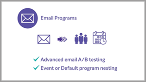

# Tutorials zu [!DNL Marketo Engage]

Durchsuchen Sie unsere Tutorial-Bibliothek, um [!DNL Marketo Engage] optimal zu nutzen. Diese Tutorials können als Ergänzung zur [[!DNL Marketo] Produktdokumentation](https://experienceleague.adobe.com/docs/marketo/using/home.html?lang=de){target="_blank"} dienen, um Ihnen das Verständnis der Funktionen für Marketing-Automatisierung zu erleichtern.

<!-- 

 
-->

## Neue Funktionen {#whats-new}

* [Übersicht über E-Mail an Designer](/help/main/email-marketing/email-designer-overview.md)
  _Erfahren Sie mehr über die vielen Funktionen, die in der Marketo Engage E-Mail-Designer verfügbar sind._

* [Marketo Engage in Adobe Experience Cloud](/help/main/fundamentals/marketo-engage-aec.md)
  _Erfahren Sie, wie Sie über Adobe Experience Cloud auf Marketo Engage zugreifen können, und sehen Sie sich die Benutzeroberfläche an._

* [Vorlagenimport](/help/main/shorts/template-import.md)
  _Erfahren Sie, wie Sie Ihre vorhandenen E-Mail-Vorlagen aus dem klassischen Editor in die E-Mail-Designer importieren, um Ihre Designs beizubehalten und die Vorlagenerstellung zu beschleunigen.._

## Die beliebtesten Videos {#most-popular-videos}

<table>
<tr>
<td>

<a href="https://experienceleague.adobe.com/de/docs/marketo-learn/tutorials/programs-and-campaigns/smart-campaigns-101"><strong>Grundlagen zu intelligenten Kampagnen</strong></a>

</td>
<td>

<a href="https://experienceleague.adobe.com/de/docs/marketo-learn/tutorials/dynamic-chat/conversational-forms"><strong>Konversationsformulare</strong></a>

</td>
<td>

<a href="https://experienceleague.adobe.com/de/docs/marketo-learn/tutorials/fundamentals/programs-and-campaigns"><strong>Grundlegendes zu Marketo-Programmen und -Kampagnen</strong></a>

</td>
</tr>
</table>
