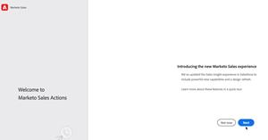

# Sales Insight-Aktionen - Tutorials

Verwenden Sie [!UICONTROL Sales Insights], um die Akquise mit Marketing-gestützten Intelligence- und Interaktions-Tools in einem einzigen Workflow zu beschleunigen.

>[!NOTE]
>
>Marketo Sales Insight Actions ist eine Web-basierte Anwendung, die über das [Marketo Sales Insight Package&rbrace; ausschließlich mit Salesforce CRM integriert ](https://experienceleague.adobe.com/de/docs/marketo/using/product-docs/marketo-sales-insight/msi-for-salesforce/installation/install-marketo-sales-insight-package-in-salesforce-appexchange){target="_blank"}. Dies wird manchmal als &quot;Marketo-Vertrieb“ oder einfach als „Aktionen“ bezeichnet.

## Vorgestellte Tutorials {#featured-tutorials}

<table style="table-layout:fixed">
<tr>
<td>

<a href="/help/sales-insight-actions/sales-insight-actions-overview.md"><strong>Sales Insight-Aktionen - Übersicht</strong></a>

</td>
<td>

<a href="/help/sales-insight-actions/accessing-your-sales-insight-actions-instance.md"><strong>Zugriff auf Ihre Sales Insight-Aktionsinstanz</strong></a>

</td>
<td>

<a href="/help/sales-insight-actions/configure-sales-activity-logging-to-salesforce.md"><strong>Konfigurieren der Protokollierung von Verkaufsaktivitäten für [!DNL Salesforce]</strong></a>

</td>
</tr>
</table>

## Vorgestellte Artikel {#featured-articles}

<table style="table-layout:fixed">
<tr>
<td>

<a href="https://experienceleague.adobe.com/docs/marketo/using/product-docs/marketo-sales-insight/actions/sales-insight-actions-feature-overview.html?lang=de"><strong>Funktionsübersicht für Sales Insight-Aktionen</strong></a>

<em>Beschleunigen Sie die Akquise mit Marketing-gestützten Intelligence- und Interaktions-Tools.</em>

</td>
<td>

Benutzerhandbuch zum Onboarding von <a href="https://experienceleague.adobe.com/docs/marketo/using/product-docs/marketo-sales-insight/actions/getting-started/sales-insight-actions-user-onboarding-checklist.html?lang=de"><strong>[!DNL Sales Insight Actions]</strong></a>

<em>Schritte, die neue Benutzer ausführen müssen, um zu beginnen.</em>

</td>
<td>

<a href="https://experienceleague.adobe.com/docs/marketo/using/product-docs/marketo-sales-insight/actions/admin/actions-data-sync-faq.html?lang=de"><strong>Häufig gestellte Fragen zur Datensynchronisation für Aktionen</strong></a>

<em>Häufig gestellte Fragen zur Funktionsweise der Datenvereinheitlichungssynchronisierung.</em>

</td>
</tr>
</table>
